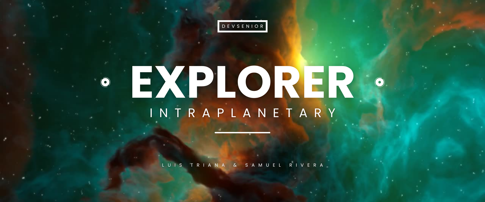

<h1 align="center">RETO 01 - Simulador de Viaje Interplanetario 🚀</h1>

</img>

<h3>Introducción</h3>

Este programa simula un viaje interplanetario en el que el usuario selecciona un planeta y la cantidad de combustible para el viaje. El programa evalúa si es posible llegar al destino con el combustible proporcionado y realiza una cuenta regresiva de tiempo y consumo de combustible en paralelo utilizando hilos y sincronización.

<a href="https://youtu.be/VV7WT9pXnbc">Puedes encontrar la presentación acá mismo 🎥</a>

<h3 align="left">Languages and Tools 🛠</h3>

  

<h3>Funciones Principales:</h3>
<h4>Objetivos 👨🏽‍🚀</h4>
<ul>
<li>Seleccionar destino interplanetario</li>
<li>Calcular distancia y tiempo de viaje</li>
<li>Gestionar recursos de la nave</li>
<li>Simular eventos aleatorios durante el viaje</li>
<li>Monitorear el estado de viaje</li>
</ul>

<h3 align="center">Get in Touch 📱 </h3>
<ul>
<li>Samuel Rivera </li>
<li>Luis Triana </li>
</ul>
